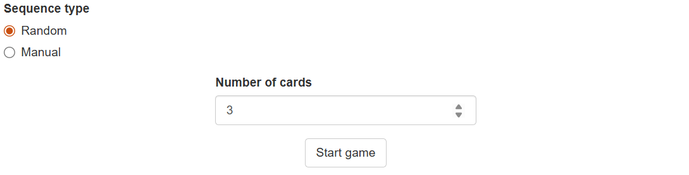
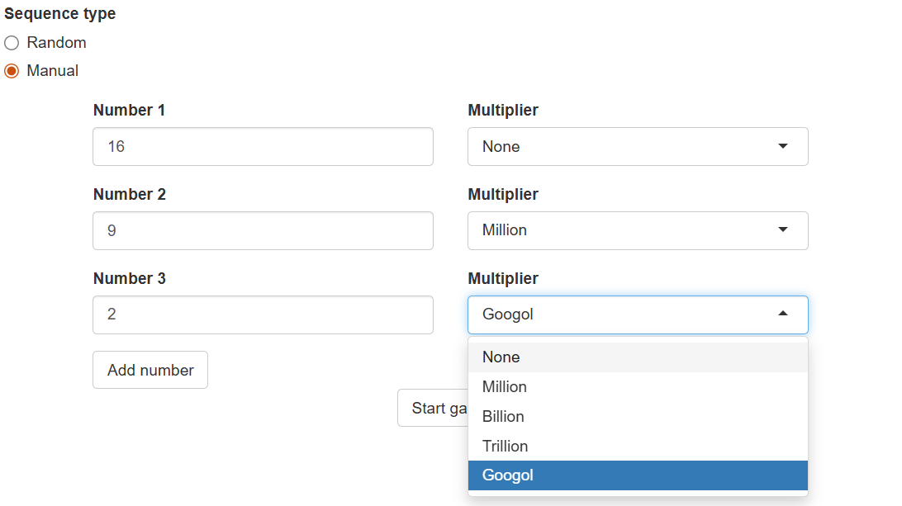
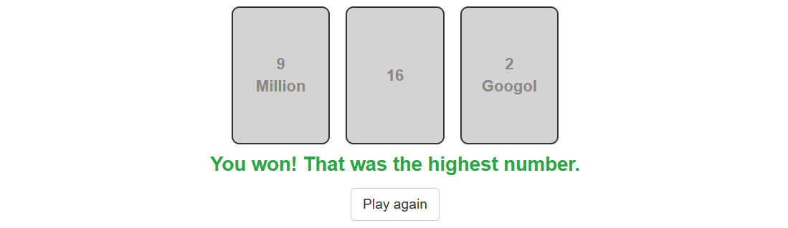
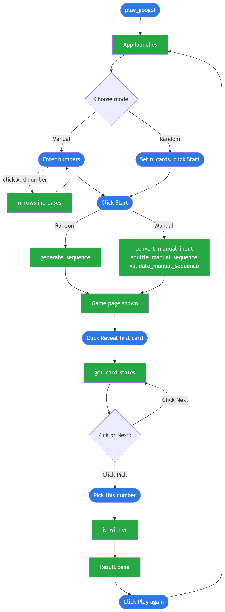

```{r, include = FALSE}
knitr::opts_chunk$set(
  collapse = TRUE,
  comment = "#>"
)
```

## What is the Googol Game?

The Googol Game is a gambling problem first described by Martin Gardner. A sequence 
of numbers is revealed one at a time. Your goal is to pick the highest number in
the sequence — but once you pass a number, you cannot go back. You win only if
the number you pick turns out to be the highest in the entire sequence,
including numbers you never saw.

## How to install the app

```{r, eval = FALSE}
# install.packages("devtools")
devtools::install_github("Programming-The-Next-Step-2026/GoogolGame")
```

## How to launch the app

```{r, eval = FALSE}
library(GoogolGame)
play_googol()
```

## Scenario

**Purpose**: scenario that describes how to use the GoogolGame app.

**User**: everybody that is interested in the Googol Game or optimal stopping theory.
It is especially fun if you play it together with a second person!

**Equipment**: any computer with a supported browser. You must have installed R. All
other dependencies will be installed automatically when downloading the package.

**Scenario**:

**Step 1: Choose a sequence type**

When the app opens, choose how to generate the sequence of numbers:

- **Random**: the app generates a sequence of random numbers for you. Enter
  how many cards you want (e.g. 3) and click **Start game**.
  


- **Manual**: enter your own numbers one at a time. For each number, type a
  value and optionally select a multiplier (e.g. select `2` and `Googol` to
  enter 2 Googol). Click **Add number** to add another number. You need at 
  least 2 numbers and you can add as many numbers as you want.



  **Note**: manual entry requires a second person — one who enters the numbers
  and one who plays the game! Hand the keyboard to a friend to enter the 
  numbers and don't peek at the screen.

**Step 2: Play the game**

After clicking **Start game**, all cards are shown face-down in blue. Click
**Reveal first card** to turn over the first card.


From there, after each reveal you have two choices:

- Click **Pick this number** if you think the current card (highlighted in
  green) is the highest.
- Click **Next** to pass it and reveal the next card. Passed cards turn grey.


On the last card, only **Pick this number** is available — you must pick.


**Step 3: See the result**

After picking, the app shows whether you won or lost:

- **Win**: your chosen number was the highest in the sequence.
- **Loss**: a higher number existed elsewhere in the sequence, along with what
  that number was.



Click **Play again** to return to the setup page and start a new game.

## Flowchart

The flowchart below shows the full flow of the app, distinguishing between
user actions and the software functions triggered behind the scenes.

**Colours**: <span style="color:#2c7be5">■</span> blue = user action,
<span style="color:#28a745">■</span> green = software action.



## Extra: optimal stopping theory

Is there a strategy that maximises your chances of picking the highest number?
Yes — and the answer comes from mathematics.

The optimal strategy is to let the first 37% of cards pass without
picking, no matter how high they are. After that, pick the next card that is
higher than all the cards you have already seen. If no such card appears, pick
the last card.

This strategy gives you approximately a 37% chance of picking the highest
number, regardless of how many cards there are. Remarkably, no other strategy
can do better in the long run.

Try it out: with 10 cards, skip the first 3 or 4 and then pick the next card
that beats them all.
